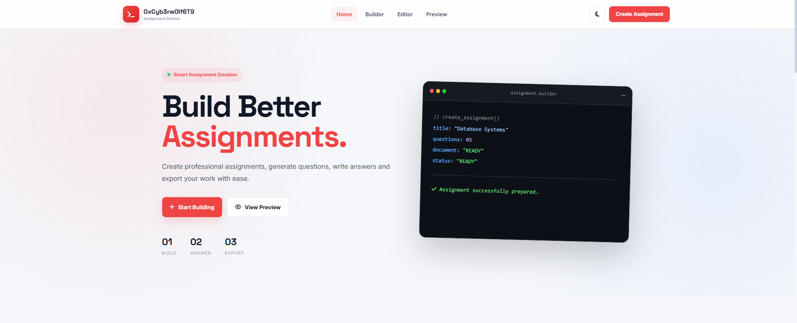
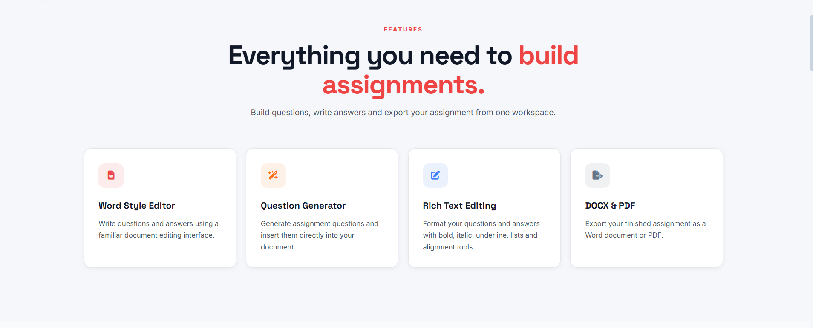
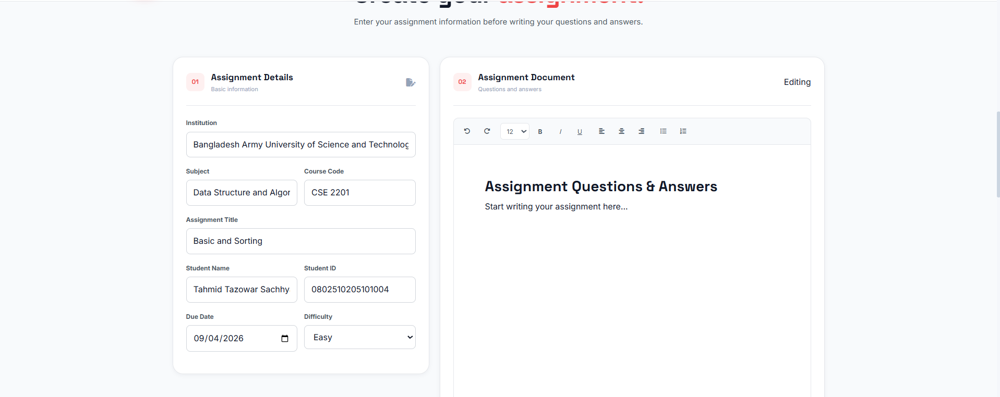
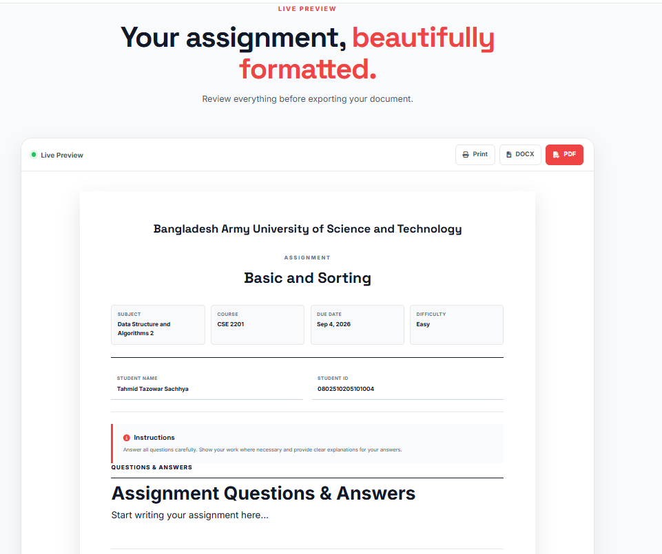

# 0xCyb3rw0lf6T9 — Assignment Builder

<p align="center">
  
  
  
  
</p>

<p align="center">
  <strong>A modern, responsive assignment creation tool for students, teachers, and educators.</strong>
</p>

<p align="center">
  Create • Organize • Preview • Print • Save
</p>

---


 ## 📌 About The Project

 **0xCyb3rw0lf6T9 Assignment Builder** is a modern browser-based application designed to make academic assignment creation simple, organized, and professional.

 The application provides an intuitive interface where users can:

 - Enter assignment information
- Dynamically create different types of questions
- Preview the final assignment in real time
- Switch between light and dark themes
- Print assignments
- Save assignment data as JSON

 The project is built entirely with **HTML, CSS, and vanilla JavaScript**, so there is no backend or complicated setup required.

---

 ## ✨ Features

 ### 📝 Assignment Builder

 Create professional assignments by entering:

 - Institution name
- Subject
- Course code
- Assignment title
- Student name
- Student ID
- Due date
- Difficulty level

 ### ❓ Dynamic Question Management

 Easily manage assignment questions directly from the browser.

 - Add unlimited questions
- Delete questions
- Edit questions
- Assign individual marks
- Automatically calculate total marks
- Automatically number questions

 ### 📚 Multiple Question Types

 The builder currently supports:

 - Short Answer
- Long Answer
- Multiple Choice
- True / False

 ### 🎯 Multiple Choice Questions

 Multiple-choice questions include:

 - Custom option text
- 2–6 answer options
- Correct-answer selection
- Add option functionality
- Remove option functionality

 ### 👀 Live Preview

 The assignment preview updates automatically as you edit the assignment.

 You can see:

 - Institution
- Assignment title
- Subject
- Course
- Due date
- Difficulty
- Student information
- Questions
- Marks
- Total marks

 ### 🖨️ Print Ready

 The project includes a dedicated print stylesheet designed for clean assignment printing.

 The print layout includes:

 - A4 page configuration
- Clean margins
- Printable assignment content
- Hidden application interface
- Page-friendly question formatting

 ### 💾 Save Assignment

 Assignments can be exported directly from the browser as `.json` files.

 Example:

```
{
  "institution": "University of Technology",
  "subject": "Web Development",
  "course": "CSE-301",
  "title": "Frontend Development Assignment",
  "studentName": "John Doe",
  "studentId": "2026-0001",
  "dueDate": "2026-10-01",
  "difficulty": "Medium",
  "questions": []
}
```

 ### 🌙 Dark Mode

 The application includes a complete dark mode interface.

 The selected theme is saved using browser `localStorage`, so the preference remains after refreshing the page.

 ### 📱 Fully Responsive

 The application is designed for:

 - Desktop
- Laptop
- Tablet
- Mobile
- Small-screen devices

 ### 🍞 Toast Notifications

 Users receive visual feedback for important actions such as:

 - Adding questions
- Removing questions
- Clearing assignments
- Generating previews
- Saving assignments
- Changing themes

 ### ⌨️ Keyboard Shortcut

 Generate the assignment preview quickly using:

```
Ctrl + Enter
```

 or on macOS:

```
Cmd + Enter
```

 ### ♿ Accessibility

 The project includes several accessibility-focused features:

 - Semantic HTML
- Form labels
- ARIA labels
- Accessible navigation
- Keyboard-friendly controls
- Reduced-motion support
- Status announcements

---

 ## 🖥️ Demo

 
 
 
 

 ## 📸 Screenshots

 Add screenshots of your project here.

 ### 🏠 Home

 ### 🛠️ Assignment Builder

 ### 👀 Live Preview

 ### 🌙 Dark Mode

---

 ## 🛠️ Built With

 This project uses simple and modern frontend technologies.

 | Technology | Purpose |
| --- | --- |
| HTML5 | Application structure |
| CSS3 | Styling and responsive layout |
| JavaScript | Application logic |
| Font Awesome | Icons |
| Google Fonts | Typography |
| LocalStorage | Theme persistence |

---

 ## 🎨 Design

 The interface follows a modern developer-inspired visual style.

 ### Color Palette

 | Color | Hex |
| --- | --- |
| Dark | `#2b2d42` |
| Dark 2 | `#222436` |
| Dark 3 | `#171925` |
| Red | `#e84855` |
| Orange | `#ee6c4d` |
| Green | `#62d894` |
| Blue | `#6c9bd2` |
| Light | `#edf2f4` |
| White | `#ffffff` |

### Typography

 The project uses:

 - **Space Grotesk** — Headings and branding
- **Inter** — Body text and interface elements
- **Monospace** — Terminal-style code display

---

 ## 📂 Project Structure

```
assignment-builder/
│
├── index.html
├── style.css
├── script.js
├── README.md
│
└── assets/
    ├── home.png
    ├── builder.png
    ├── preview.png
    └── dark-mode.png
```

---

 ## 🚀 Getting Started

 Follow these steps to run the project locally.

 ### 1\. Clone the Repository

```
git clone https://github.com/YOUR-USERNAME/assignment-builder.git
```

 ### 2\. Navigate to the Project

```
cd assignment-builder
```

 ### 3\. Open the Project

 You can simply open:

```
index.html
```

 in your browser.

 No build process is required.

---

 ## 💻 Run With VS Code

 For the best development experience, you can use **Live Server**.

 ### Step 1

 Open the project in Visual Studio Code.

 ### Step 2

 Install the **Live Server** extension.

 ### Step 3

 Right-click:

```
index.html
```

 and select:

```
Open with Live Server
```

 The application will open in your browser.

---

 ## 🧩 How To Use

 ### Step 1 — Enter Assignment Details

 Fill in the assignment information:

```
Institution
Subject
Course Code
Assignment Title
Student Name
Student ID
Due Date
Difficulty
```

 ### Step 2 — Add Questions

 Click:

```
+ Add Question
```

 A new question will be added automatically.

 ### Step 3 — Choose Question Type

 Select one of:

```
Short Answer
Long Answer
Multiple Choice
True / False
```

 ### Step 4 — Assign Marks

 Enter the number of marks for each question.

 The total marks are calculated automatically.

 ### Step 5 — Preview

 Click:

```
Generate Preview
```

 The application will scroll to the live assignment preview.

 ### Step 6 — Print

 Click:

```
Print
```

 Your browser's print dialog will open with the assignment formatted for printing.

 ### Step 7 — Save

 Click:

```
Save
```

 The assignment information will be downloaded as a JSON file.

---

 ## 📋 Question Types

 ### Short Answer

 Short-answer questions provide a single line where students can enter their answer.

```
1. Explain the concept of responsive web design.

_____________________________________________
```

 ### Long Answer

 Long-answer questions provide multiple writing lines.

```
2. Explain the importance of semantic HTML.

_____________________________________________

_____________________________________________

_____________________________________________

_____________________________________________
```

 ### Multiple Choice

 Multiple-choice questions support between 2 and 6 options.

```
3. Which language is used to style web pages?

A. HTML
B. CSS
C. JavaScript
D. Python
```

 ### True / False

 True/False questions provide two selectable answers.

```
4. CSS is used to style HTML documents.

☐ True

☐ False
```

---

 ## 💾 Data Storage

 The application currently operates primarily in the browser.

 No server-side database is required.

 The **Save** functionality creates a JSON file using the browser's Blob API.

 The exported structure contains:

```
{
  "institution": "",
  "subject": "",
  "course": "",
  "title": "",
  "studentName": "",
  "studentId": "",
  "dueDate": "",
  "difficulty": "",
  "questions": []
}
```

---

 ## 🌙 Theme Persistence

 The selected theme is stored in:

```
localStorage
```

 using the key:

```
assignment-builder-theme
```

 Possible values are:

```
light
dark
```

---

 ## 🖨️ Printing

 The project includes a dedicated CSS print layout using:

```
@media print
```

 The print system:

 - Hides the application interface
- Displays only the assignment
- Uses A4 page sizing
- Removes unnecessary shadows
- Preserves question formatting
- Prevents questions from breaking unnecessarily between pages

---

 ## 🔐 Privacy

 The application does not currently require user registration or authentication.

 Assignment data is handled locally in the browser.

 There is currently:

 - No backend
- No database
- No account system
- No authentication system
- No server-side assignment storage

---

 ## 🔮 Future Improvements

 The project can be extended with many useful features.

 ### Assignment Management

 - [ ] Import saved JSON assignments
- [ ] Duplicate assignments
- [ ] Assignment templates
- [ ] Auto-save
- [ ] Assignment history
- [ ] Search assignments

 ### Question Management

 - [ ] Drag-and-drop question ordering
- [ ] Duplicate question
- [ ] Question categories
- [ ] Difficulty per question
- [ ] Automatic question numbering
- [ ] Question bank

 ### Export

 - [ ] Direct PDF export
- [ ] DOCX export
- [ ] Custom PDF templates
- [ ] Multiple page layouts
- [ ] Custom headers and footers

 ### Customization

 - [ ] Custom instructions
- [ ] Custom logo
- [ ] Custom colors
- [ ] Custom fonts
- [ ] Grading configuration
- [ ] University templates

 ### Platform Features

 - [ ] User authentication
- [ ] Cloud storage
- [ ] Database integration
- [ ] Assignment sharing
- [ ] Public assignment links
- [ ] Teacher dashboard
- [ ] Student dashboard

---

 ## 📈 Roadmap

 ### Version 1.0

 - [x] Assignment information
- [x] Dynamic questions
- [x] Multiple question types
- [x] Multiple-choice options
- [x] Live preview
- [x] Total marks
- [x] Print support
- [x] JSON export
- [x] Dark mode
- [x] Responsive design

 ### Version 1.1

 - [ ] Import JSON assignments
- [ ] Question duplication
- [ ] Drag-and-drop ordering
- [ ] Improved validation
- [ ] Better print pagination

 ### Version 2.0

 - [ ] PDF generation
- [ ] Assignment templates
- [ ] Cloud storage
- [ ] User accounts
- [ ] Assignment sharing

---

 ## 🤝 Contributing

 Contributions are welcome.

 If you would like to improve this project, follow these steps.

 ### 1\. Fork the Repository

 Fork the project to your GitHub account.

 ### 2\. Clone Your Fork

```
git clone https://github.com/YOUR-USERNAME/assignment-builder.git
```

 ### 3\. Create a Branch

```
git checkout -b feature/new-feature
```

 ### 4\. Make Your Changes

 Update the project and test your changes.

 ### 5\. Commit Your Changes

```
git add .
git commit -m "feat: add new feature"
```

 ### 6\. Push Your Branch

```
git push origin feature/new-feature
```

 ### 7\. Create a Pull Request

 Open a Pull Request from your branch to the main repository.

---

 ## 🐛 Bug Reports

 Found a bug?

 Please open a GitHub issue and provide:

 - A clear description of the issue
- Steps to reproduce the issue
- Expected behavior
- Actual behavior
- Browser information
- Operating system
- Screenshots or screen recordings if possible

---

 ## 💡 Feature Requests

 Have an idea for improving Assignment Builder?

 Open a feature request and describe:

 1. What problem the feature solves
2. How the feature should work
3. Why it would be useful
4. Any example designs or references

---

 ## 📜 License

 This project is licensed under the **MIT License**.

 You are free to:

 - Use the project
- Modify the project
- Distribute the project
- Use it commercially
- Create derivative works

 See the `LICENSE` file for complete license terms.

---

 ## 👨‍💻 Author

 \<p align="center"\> \<strong\>0xCyb3rw0lf6T9\</strong\> \<br\> Assignment Builder \</p\>
---

 ## 🌐 Connect

 \<p align="center"\> \<a href="https://github.com/YOUR-USERNAME"\> \ \</a\> \<a href="https://www.linkedin.com/in/YOUR-USERNAME/"\> \ \</a\> \</p\>
---

 ## ⭐ Support

 If you find **Assignment Builder** useful, consider giving the repository a ⭐.

 It helps support the project and encourages future development.

---

 ## 📊 Project Information

 | Category | Details |
| --- | --- |
| Project | Assignment Builder |
| Version | `1.0.0` |
| Status | Active Development |
| Frontend | HTML5, CSS3, JavaScript |
| Backend | None |
| Database | None |
| License | MIT |
| Responsive | Yes |
| Dark Mode | Yes |
| Print Support | Yes |
| JSON Export | Yes |

---

 ## 🏷️ Repository Topics

 Add these topics to your GitHub repository:

```
assignment-builder
javascript
html
css
frontend
web-development
education
education-tool
student-tools
teacher-tools
assignment
assignment-generator
live-preview
responsive-design
dark-mode
vanilla-javascript
```

---

 ## 📌 GitHub Repository Description

 Use this as your GitHub repository description:

```
A modern responsive assignment builder with dynamic questions, live preview, dark mode, JSON export, and print-ready formatting.
```

---

 \<p align="center"\> \<strong\>0xCyb3rw0lf6T9 Assignment Builder\</strong\> \<br\> Built with HTML • CSS • JavaScript \<br\>\<br\> ⭐ Star the repository if you find it useful. \</p\>

 This version is valid Markdown, with the HTML centered sections and badges properly formatted. Replace `YOUR-USERNAME` with your actual GitHub username and make sure the screenshot files exist under `assets/`.
